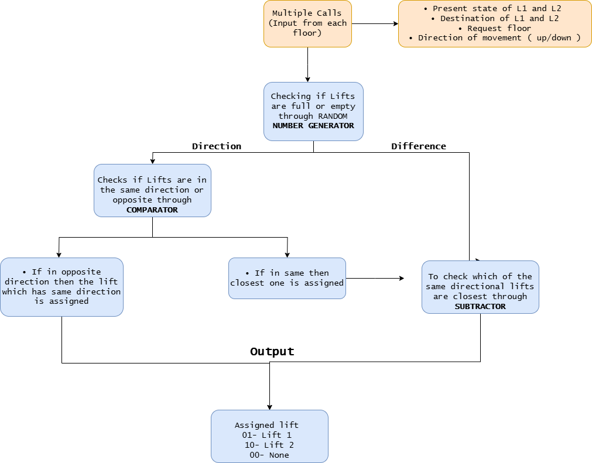
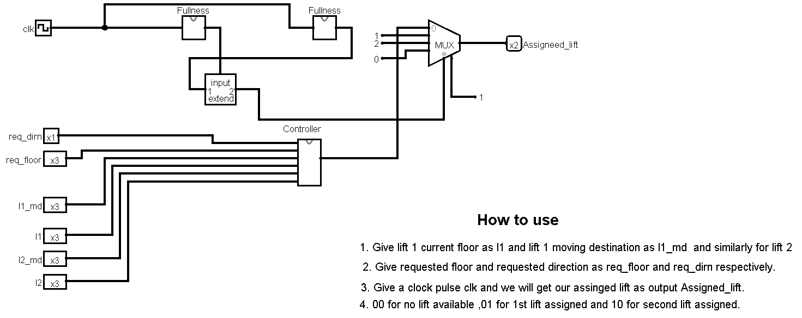
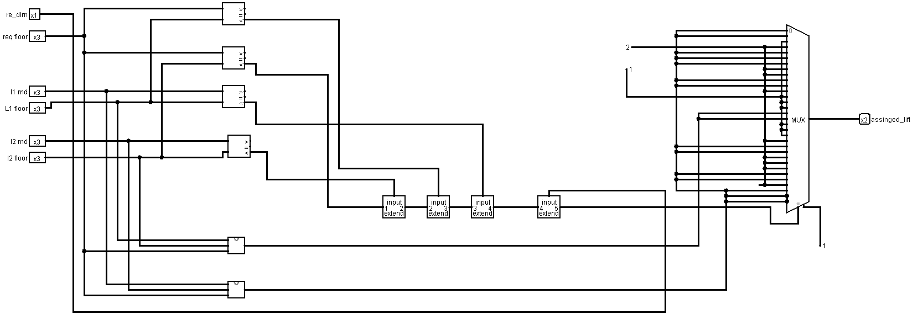
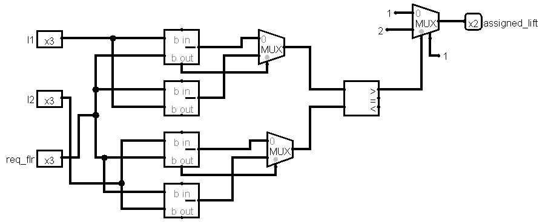
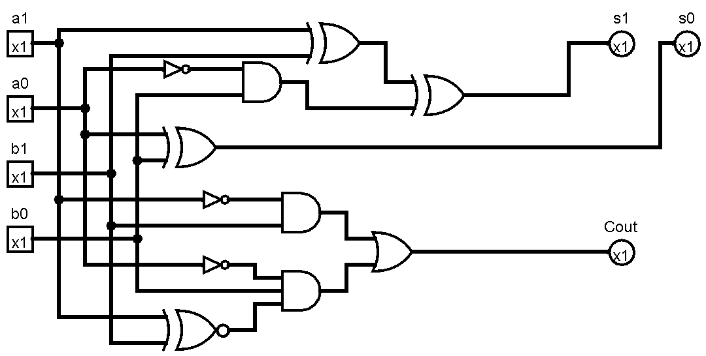
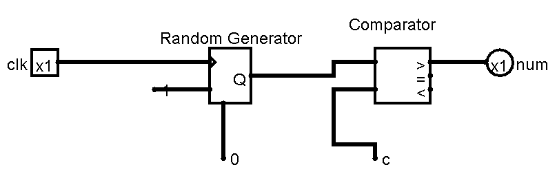
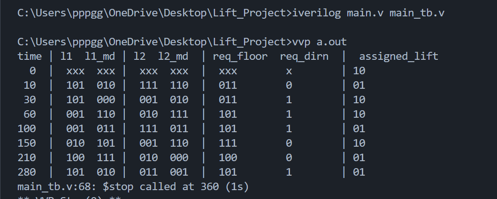

# ElevateX: The Intelligent Elevator Synchronization System

## Abstract :
<details >
  
**1.Motivation:** In modern buildings equipped with multiple elevators, the occupants are
likely to press both call buttons. Hence, inefficiencies are created where several elevators have
responded to the same call. This wastes a lot of energy since elevators make unnecessary stops
and wait times increase, especially during peak hours. In addition, elevators mostly arrive at
floors that are not occupied by passengers. There is either somebody having used another
elevator or moved away. The energy consumption of a high-rise building is improved along
with reduced operational costs if these inefficiencies are addressed.  <br/> <br/>

**2. Problem Statement:** Current elevator control systems are inefficient, leading to increased
energy consumption and longer wait times. To solve this, a central control system will manage
two elevators in a N-floor building. A single call switch on each floor, along with call prioritization, will ensure only one elevator responds, reducing unnecessary stops hence it optimise time and
energy use during peak hours. <br/> <br/>

**3.Features:**  <br/>
- Centralized control system managing both elevators
- Single call button on each floor
- Priority-based call assignment
- Optimized energy consumption

  </details>
## Block Diagram :
<details >

  
  
</details>

## Working:
<details >
<br/> <br/>
Working of our project :

Inputs :
1) Present state of Lift 1 and Lift 2 
2) Destination of Lift 1 and Lift 2
3) Floor from which request is made
4) Direction which you want to go (Up or Down) 

Outputs :
One of the lift which is assigned through logic  (Lift 1 or Lift 2)

Logic:

We have set PRIORITIES for the assignment of lift :

1) Whether lifts are full or empty : 

Possible cases ( Lift 1 full , Lift 2 Full , Both Lifts full , Both lifts empty )
Through a 4 bit random number generator , if the generated number is greater than 12  then the lift is considered as full . 

2) Direction and Difference :

Whether the lifts are in same direction or in opposite direction , If in the same direction to the requested floor then the closest one to the request floor will be assigned . 
If in opposite direction then the lift which has the same direction with the request floor will be assigned .
<br/> <br/>

| L1  | L1_md | L2  | L2_md | Req_Floor | Req_Dir <br/> (1 for up, 0 for down) | Assigned Lift |
|-----|--------|-----|--------|------------|---------------------------------|---------------|
| 0   | 2      | 2   | 5      | 2          | 0                               | 1             |
| 1   | 7      | 4   | 2      | 6          | 1                               | 1             |
| 2   | 5      | 1   | 6      | 7          | 0                               | 2             |
| 4   | 7      | 2   | 0      | 4          | 0                               | 1             |
| 5   | 2      | 3   | 1      | 5          | 1                               | 1             |
| 3   | 3      | 0   | 6      | 1          | 0                               | 1             |
| 4   | 6      | 7   | 2      | 1          | 1                               | 2             |
| 6   | 2      | 4   | 6      | 2          | 0                               | 1             |
| 0   | 7      | 2   | 3      | 3          | 0                               | 2             |
| 0   | 3      | 6   | 3      | 4          | 1                               | 1             |
| 2   | 2      | 7   | 7      | 6          | 0                               | 2             |
| 7   | 3      | 0   | 4      | 6          | 0                               | 1             |
| 6   | 5      | 1   | 7      | 7          | 0                               | 2             |
| 4   | 4      | 6   | 0      | 0          | 1                               | 2             |
| 5   | 6      | 3   | 6      | 1          | 0                               | 1             |
| 3   | 7      | 0   | 4      | 7          | 1                               | 1             |
| 5   | 6      | 3   | 6      | 1          | 0                               | 1             |

</details>


  ## Logisim :
<details >
  
### Main Circuit
<details >

 

</details >

### Controller Circuit
<details >

 
</details >

  
### Difference Circuit
<details >

 
</details >

### Subractor Circuit
<details >

 
</details >
 
### Fullness Circuit
<details >

 
</details >
 
</details>

  ## Verilog:
  
  ### Behavioral Model
<details >
  
  ####  Main File
  
 ```verilog
module lfsr_random_num(
    input clk,          // Clock signal
    input reset,        // Reset signal to reinitialize LFSR
    output reg [3:0] random_num // 4-bit random number
);
    reg [3:0] lfsr;

    always @(posedge clk or posedge reset) begin
        if (reset)
            lfsr <= 4'b0001;  // Initial state
        else begin
            // XOR feedback (taps at position 3 and 2 for 4-bit LFSR)
            lfsr <= {lfsr[2:0], lfsr[3] ^ lfsr[2]};
        end
    assign random_num = lfsr;
    end

endmodule

module fullness_check (
    input [3:0] random_num,
    output reg full
);
    always @(*) begin
        if (random_num > 4'd15)
            full = 1'b1;
        else
            full = 1'b0;
    end
endmodule

module priority_controller (
    input [2:0] curr_floor_L1, curr_floor_L2, // Current floors of Lift 1 and Lift 2
    input [2:0] dest_floor_L1, dest_floor_L2, // Destination floors of Lift 1 and Lift 2
    input [2:0] req_floor,                    // Requested floor
    input req_direction,                      // Requested direction (1 = up, 0 = down)
    input full_L1, full_L2,                   // Fullness status of Lift 1 and Lift 2
    output reg [1:0] selected_lift            // 00 = none, 01 = Lift 1, 10 = Lift 2
);

    reg [2:0] dist_L1, dist_L2;               // Variables for distance between requested floor and current lift positions

    // Helper function to calculate absolute difference between two floors
    function [2:0] abs_diff(input [2:0] a, input [2:0] b);
        begin
            if (a > b)
                abs_diff = a - b;
            else
                abs_diff = b - a;
        end
    endfunction

    always @(*) begin
        // Default output
        selected_lift = 2'b00;

        // Check if either lift is full
        if (full_L1 && full_L2) begin
            // Both lifts are full, no lift selected
            selected_lift = 2'b00;
        end else if (full_L1) begin
            // Lift 1 is full, select Lift 2
            selected_lift = 2'b10;
        end else if (full_L2) begin
            // Lift 2 is full, select Lift 1
            selected_lift = 2'b01;
        end else begin
            // Check if either lift is at rest (current floor = destination floor)
            if (curr_floor_L1 == dest_floor_L1 && curr_floor_L2 == dest_floor_L2) begin
                // Both lifts are at rest, calculate proximity to the requested floor
                dist_L1 = abs_diff(req_floor, curr_floor_L1);
                dist_L2 = abs_diff(req_floor, curr_floor_L2);

                if (dist_L1 < dist_L2)
                    selected_lift = 2'b01;  // Lift 1 is closer
                else
                    selected_lift = 2'b10;  // Lift 2 is closer
            end else begin
                // Check if lifts have passed the request floor in their respective directions
                if (req_direction == 1) begin  // Request going up
                    if (curr_floor_L1 > req_floor) begin
                        // Lift 1 has passed the request floor going up, prioritize Lift 2
                        selected_lift = 2'b10;
                    end else if (curr_floor_L2 > req_floor) begin
                        // Lift 2 has passed the request floor going up, prioritize Lift 1
                        selected_lift = 2'b01;
                    end else begin
                        // Neither lift has passed the request floor, calculate proximity
                        dist_L1 = abs_diff(req_floor, curr_floor_L1);
                        dist_L2 = abs_diff(req_floor, curr_floor_L2);
                        
                        if (dist_L1 < dist_L2)
                            selected_lift = 2'b01;  // Lift 1 is closer
                        else
                            selected_lift = 2'b10;  // Lift 2 is closer
                    end
                end else begin  // Request going down
                    if (curr_floor_L1 < req_floor) begin
                        // Lift 1 has passed the request floor going down, prioritize Lift 2
                        selected_lift = 2'b10;
                    end else if (curr_floor_L2 < req_floor) begin
                        // Lift 2 has passed the request floor going down, prioritize Lift 1
                        selected_lift = 2'b01;
                    end else begin
                        // Neither lift has passed the request floor, calculate proximity
                        dist_L1 = abs_diff(req_floor, curr_floor_L1);
                        dist_L2 = abs_diff(req_floor, curr_floor_L2);
                        
                        if (dist_L1 < dist_L2)
                            selected_lift = 2'b01;  // Lift 1 is closer
                        else
                            selected_lift = 2'b10;  // Lift 2 is closer
                    end
                end
            end
        end
    end
endmodule


module elevator_controller (
    input clk, reset,  // Clock and reset signals
    input [2:0] curr_floor_L1, curr_floor_L2, dest_floor_L1, dest_floor_L2, req_floor,
    input req_direction,
    output [1:0] selected_lift
);
    wire full_L1, full_L2;

    wire [3:0] random_num_L1, random_num_L2;

    // Instantiate LFSR-based random number generators for both lifts
    lfsr_random_num rng1 (.clk(clk), .reset(reset), .random_num(random_num_L1));
    lfsr_random_num rng2 (.clk(clk), .reset(reset), .random_num(random_num_L2));

    // Fullness check for both lifts
    fullness_check fc1 (.random_num(random_num_L1), .full(full_L1));
    fullness_check fc2 (.random_num(random_num_L2), .full(full_L2));

    // Priority controller module
    priority_controller pc (
        .curr_floor_L1(curr_floor_L1), .curr_floor_L2(curr_floor_L2),
        .dest_floor_L1(dest_floor_L1), .dest_floor_L2(dest_floor_L2),
        .req_floor(req_floor), .req_direction(req_direction),
        .full_L1(full_L1), .full_L2(full_L2),
        .selected_lift(selected_lift)
    );
endmodule
```

 ####  TestBench File

 ```verilog
module testbench();
    reg clk, reset;
    reg [2:0] curr_floor_L1, curr_floor_L2, dest_floor_L1, dest_floor_L2, req_floor;
    reg req_direction;
    wire [1:0] selected_lift;

    // Instantiate the elevator controller
    elevator_controller ec (
        .clk(clk), .reset(reset),
        .curr_floor_L1(curr_floor_L1), .curr_floor_L2(curr_floor_L2),
        .dest_floor_L1(dest_floor_L1), .dest_floor_L2(dest_floor_L2),
        .req_floor(req_floor), .req_direction(req_direction),
        .selected_lift(selected_lift)
    );

    // Clock generation
    always #5 clk = ~clk;  // 10-unit time period

    initial begin
        // Initialize signals
        clk = 0;
        reset = 1;
        #10 reset = 0;  


        // Test cases
        curr_floor_L1 = 3'd5; curr_floor_L2 = 3'd7;
        dest_floor_L1 = 3'd2; dest_floor_L2 = 3'd6;
        req_floor = 3'd3; req_direction = 1'b0;

        #20;
        curr_floor_L1 = 3'd5; curr_floor_L2 = 3'd1;
        dest_floor_L1 = 3'd0; dest_floor_L2 = 3'd2;
        req_floor = 3'd3; req_direction = 1'b1;

        #30;
        curr_floor_L1 = 3'd1; curr_floor_L2 = 3'd2;
        dest_floor_L1 = 3'd6; dest_floor_L2 = 3'd7;
        req_floor = 3'd5; req_direction = 1'b1;

        #40;
        curr_floor_L1 = 3'd1; curr_floor_L2 = 3'd7;
        dest_floor_L1 = 3'd3; dest_floor_L2 = 3'd3;
        req_floor = 3'd5; req_direction = 1'b1;

        #50;
        curr_floor_L1 = 3'd2; curr_floor_L2 = 3'd1;
        dest_floor_L1 = 3'd5; dest_floor_L2 = 3'd6;
        req_floor = 3'd7; req_direction = 1'b0;

        #60;
        curr_floor_L1 = 3'd4; curr_floor_L2 = 3'd2;
        dest_floor_L1 = 3'd7; dest_floor_L2 = 3'd0;
        req_floor = 3'd4; req_direction = 1'b0;

        #70;
        curr_floor_L1 = 3'd5; curr_floor_L2 = 3'd3;
        dest_floor_L1 = 3'd2; dest_floor_L2 = 3'd1;
        req_floor = 3'd5; req_direction = 1'b1;

        #80;
        $stop;
    end
    initial begin
        $display("time | l1  l1_md | l2  l2_md  | req_floor  req_dirn  |  assigned_lift");
        $monitor("%3d  |  %b  %b |  %b  %b  |  %b        %b        | %b ",$time,curr_floor_L1,dest_floor_L1, curr_floor_L2, dest_floor_L2, req_floor,req_direction,selected_lift);
    end
endmodule

```

</details>

  ### Gate Model
<details >
  
  ####  Main File
  
 ```verilog

  module full_subtractor (
    input A, B, Bin,  // A - B - Bin
    output Diff, Bout
);
    wire A_xor_B;
    xor (A_xor_B, A, B);      // Difference = A ^ B
    xor (Diff, A_xor_B, Bin); // Diff = (A ^ B) ^ Bin
    wire A_nand_B;
    nand (A_nand_B, A, B);
    wire not_A_xor_B, not_Bin;
    not (not_A_xor_B, A_xor_B);
    not (not_Bin, Bin);
    wire borrow1, borrow2;
    and (borrow1, not_A_xor_B, Bin);  // Borrow generated by Bin
    and (borrow2, A_nand_B, not_Bin); // Borrow generated by A and B
    or (Bout, borrow1, borrow2);  // Combine borrows
endmodule

module subtractor_3bit (
    input [2:0] A, B,     // Inputs to be subtracted (A - B)
    output [2:0] Diff,    // Difference
    output Bout           // Borrow out
);
    wire b1, b2;          // Internal borrow signals

    // Three full subtractors for 3-bit subtraction
    full_subtractor fs0 (A[0], B[0], 1'b0, Diff[0], b1);
    full_subtractor fs1 (A[1], B[1], b1, Diff[1], b2);
    full_subtractor fs2 (A[2], B[2], b2, Diff[2], Bout);
endmodule

module comparator_3bit (
    input [2:0] A, B,
    output A_less_B, A_equal_B, A_greater_B
);
    wire [2:0] A_xor_B;
    wire A_eq_0, A_eq_1, A_eq_2;

    // XOR to find where A and B differ
    xor (A_xor_B[0], A[0], B[0]);
    xor (A_xor_B[1], A[1], B[1]);
    xor (A_xor_B[2], A[2], B[2]);

    // A == B logic
    nor (A_eq_0, A_xor_B[0], A_xor_B[1], A_xor_B[2]);
    assign A_equal_B = A_eq_0;

    // A < B logic
    wire a2_b2, a1_b1, a0_b0;
    and (a2_b2, ~A[2], B[2]);  // A2 < B2
    and (a1_b1, ~A[1], B[1], ~A_xor_B[2]); // A1 < B1 when A2 == B2
    and (a0_b0, ~A[0], B[0], ~A_xor_B[1], ~A_xor_B[2]); // A0 < B0 when A1 == B1

    or (A_less_B, a2_b2, a1_b1, a0_b0);

    // A > B logic (A greater than B)
    assign A_greater_B = ~A_less_B & ~A_equal_B;
endmodule


module priority_controller (
    input [2:0] curr_floor_L1, curr_floor_L2,   // Current floors of Lift 1 and Lift 2
    input [2:0] dest_floor_L1, dest_floor_L2,   // Destination floors of Lift 1 and Lift 2
    input [2:0] req_floor,                      // Requested floor
    input req_direction,                        // Requested direction (1 = up, 0 = down)
    output [1:0] selected_lift                  // 00 = none, 01 = Lift 1, 10 = Lift 2
);

    wire [2:0] dist_L1, dist_L2;
    wire L1_less_L2, L1_equal_L2, L1_greater_L2;
    wire L1_moving_up, L2_moving_up, L1_moving_down, L2_moving_down;
    wire L1_prioritize, L2_prioritize;

    // Subtract distances using subtractor logic
    subtractor_3bit sub_L1 (.A(curr_floor_L1), .B(req_floor), .Diff(dist_L1), .Bout());
    subtractor_3bit sub_L2 (.A(curr_floor_L2), .B(req_floor), .Diff(dist_L2), .Bout());

    // Compare distances using comparator logic
    comparator_3bit comp_dist (.A(dist_L1), .B(dist_L2), .A_less_B(L1_less_L2), .A_equal_B(L1_equal_L2), .A_greater_B(L1_greater_L2));

    // Lift direction detection (moving up or down)
    wire L1_dir, L2_dir;
    wire not_req_direction, not_L1_moving_up, not_L2_moving_up;

    xor (L1_moving_up, curr_floor_L1[2], dest_floor_L1[2]); // XOR to detect lift direction
    xor (L2_moving_up, curr_floor_L2[2], dest_floor_L2[2]);

    not (L1_moving_down, L1_moving_up);
    not (L2_moving_down, L2_moving_up);

    // Prioritizing based on direction and proximity
    wire mux_L1_selected, mux_L2_selected;
    wire L1_less_L2_with_dir, L1_greater_L2_with_dir;

    and (L1_less_L2_with_dir, L1_less_L2, L1_moving_up);  // Prioritize Lift 1 if it's closer and moving up
    and (L1_greater_L2_with_dir, L1_greater_L2, L2_moving_up);  // Prioritize Lift 2 if it's closer and moving up

    or (mux_L1_selected, L1_less_L2_with_dir, L1_moving_down);
    or (mux_L2_selected, L1_greater_L2_with_dir, L2_moving_down);

    // Final lift selection logic
    assign selected_lift = (mux_L1_selected) ? 2'b01 : (mux_L2_selected ? 2'b10 : 2'b00);
endmodule

```


 ####  TestBench File
  
 ```verilog
`timescale 1ns/1ps

module tb_priority_controller();
    // Testbench inputs
    reg [2:0] curr_floor_L1, curr_floor_L2; // Current floors of Lift 1 and Lift 2
    reg [2:0] dest_floor_L1, dest_floor_L2; // Destination floors of Lift 1 and Lift 2
    reg [2:0] req_floor;                    // Requested floor
    reg req_direction;                      // Requested direction (1 = up, 0 = down)

    // Testbench outputs
    wire [1:0] selected_lift;               // Output indicating the selected lift (00 = none, 01 = Lift 1, 10 = Lift 2)

    // Instantiate the priority controller module
    priority_controller uut (
        .curr_floor_L1(curr_floor_L1), .curr_floor_L2(curr_floor_L2),
        .dest_floor_L1(dest_floor_L1), .dest_floor_L2(dest_floor_L2),
        .req_floor(req_floor), .req_direction(req_direction),
        .selected_lift(selected_lift)
    );

    // Test cases
    initial begin
    
        curr_floor_L1 = 3'd2; dest_floor_L1 = 3'd5;
        curr_floor_L2 = 3'd3; dest_floor_L2 = 3'd3;
        req_floor = 3'd4; req_direction = 1'b1;
        #10;
        $display("Test Case 1: selected_lift = %b (Expected: 01)", selected_lift);

      
        curr_floor_L1 = 3'd5; dest_floor_L1 = 3'd1;
        curr_floor_L2 = 3'd2; dest_floor_L2 = 3'd6;
        req_floor = 3'd4; req_direction = 1'b1;
        #10;
        $display("Test Case 2: selected_lift = %b (Expected: 10)", selected_lift);

        // Test case 5: Both lifts moving up, Lift 1 closer
        curr_floor_L1 = 3'd2; dest_floor_L1 = 3'd6;
        curr_floor_L2 = 3'd1; dest_floor_L2 = 3'd5;
        req_floor = 3'd3; req_direction = 1'b1;
        #10;
        $display("Test Case 3: selected_lift = %b (Expected: 10)", selected_lift);

        
        curr_floor_L1 = 3'd5; dest_floor_L1 = 3'd1;
        curr_floor_L2 = 3'd1; dest_floor_L2 = 3'd5;
        req_floor = 3'd4; req_direction = 1'b1;
        #10;
        $display("Test Case 4: selected_lift = %b (Expected: 10)", selected_lift);

        $stop;
    end
endmodule

```
</details>

### Output
<details>


  
</details>

## References:
<details >
- [Adnan et al., 2017] Adnan, M. M. R., Sikder, M. Z., Mushfiquzzoha, M., and Zulfikar, M. (2017).
   A simulation study of an elevator control system using digital logic. Intl. J. Engrng. Trends and
    Tech, 52(3):142–150. <br/>
- [Bhatia, 2012] Bhatia, A. (2012). Building elevator systems. Continuing Education and Development, Inc. Greyridge Farm Court. Retrieved https://pdhonline. 
   com/courses/m376/m376content. <br/>
- Morris Mano <br/>
- GeekForGeeks
  
</details>
